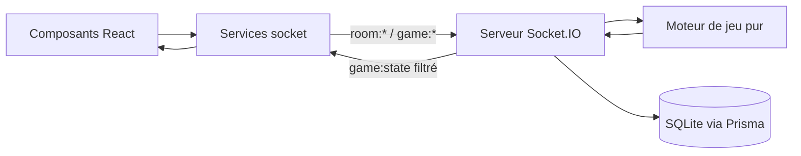

# Architecture

Skyjo Online est un monorepo npm composé de trois workspaces.

```
client/   Interface React (Vite) — affichage uniquement
server/   Express + Socket.IO + moteur de jeu — source de vérité
shared/   Types, interfaces et constantes partagés — aucune logique métier
```

## Principes

- Le **serveur** est l'unique source de vérité. Toute la logique métier et toutes les
  règles du jeu y sont implémentées.
- Le **client** n'affiche que des données reçues du serveur et envoie des actions. Il ne
  décide jamais des règles.
- Le **dossier partagé** ne contient que des types et des constantes (consommés via l'alias
  `@shared/*`).

## Flux de données



## Couches du serveur

| Dossier         | Responsabilité                                             |
| --------------- | ---------------------------------------------------------- |
| `game/`         | Moteur de jeu pur (fonctions pures, sans framework)        |
| `services/`     | Salles en mémoire et sessions de partie                    |
| `socket/`       | Gestionnaires Socket.IO (transport, aucune règle de jeu)   |
| `routes/`       | Routes REST (health, parties terminées)                    |
| `controllers/`  | Logique des routes REST                                    |
| `repositories/` | Accès aux données persistantes (Prisma)                    |
| `schemas/`      | Schémas de validation des entrées (zod)                    |

## État des parties

L'état d'une partie en cours est conservé **uniquement en mémoire** (`GameSession`).
Seules les **parties terminées** sont persistées dans SQLite via Prisma.
